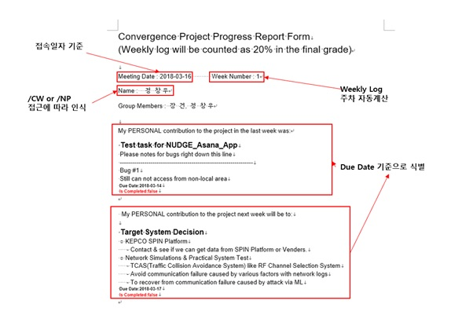
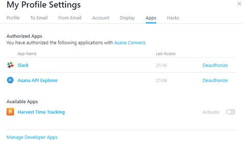
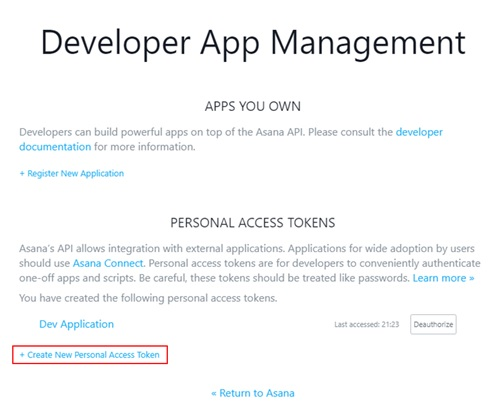

# WeeklyLog_Autogen
  This Application is for Students in Department of Smart Manufacturing Systems and Design Engineering, Seoultech
  Automatically generate weekly logs for Convergence Project.
  
  You know, Developers are really lazy. That's Why I create this application.
  
# Requirement
  Use https://Asana.com for Project Management.
  
  Need NodeJS Server somewhere. This applciation require only very low computing power. 
  
  It might work with AWS free-teir or so.
  
# How to use it

  Above image is an sample result of Weekly_Autogen.
  
  You need to change some features.. such as userAccessToken.
  
  Refer Below Image to get one! 
  
  If you have further question, contact me at luterin@luterin.com
  

# License
  3-clasue BSD
